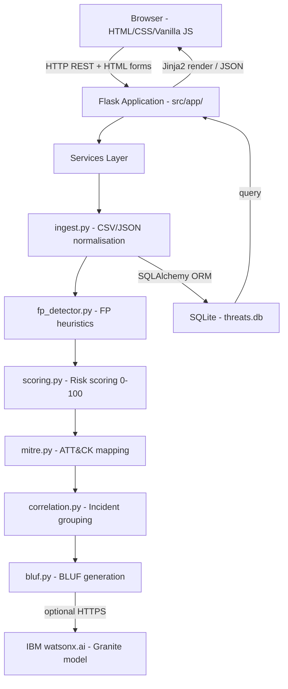

# Architecture

## System Overview

ThreatIntel Correlator is a single-process Flask application. The browser communicates
with the Flask server over HTTP for both server-rendered HTML pages and REST JSON API
calls. All business logic runs inside the Flask process across six service modules.
Persistence is handled by SQLAlchemy writing to a local SQLite file. IBM watsonx.ai
is an optional external dependency called only for BLUF generation; the application
works fully offline when the API key is absent.

## Component Descriptions

| Component | Technology | Responsibility |
|---|---|---|
| Browser dashboard | HTML5 / CSS3 / Vanilla JS / Chart.js | Six-page SOC dashboard; fetches live data via REST; renders priority donut, MITRE heatmap, alert table, incident cards |
| Flask app factory | Python 3.10+ / Flask 3.x | Creates the WSGI application, registers route blueprints, initialises extensions, applies config from `.env` |
| Page routes | Flask / Jinja2 | Server-renders six HTML pages: Summary, Upload, Alerts, Incidents, Incident Detail, MITRE Map |
| API routes | Flask / JSON | Ten REST endpoints under `/api/v1/` for data access, file upload, BLUF re-generation, and demo reset |
| Ingest service | pandas | Reads CSV/JSON uploads; maps column aliases to CommonAlert schema; handles type coercion and missing fields |
| FP detector | Pure Python | Applies six deterministic heuristics; flags false positives before scoring; records human-readable reason |
| Scoring engine | Pure Python | Computes weighted risk score (0–100) across five factors; stores per-factor breakdown for UI display |
| MITRE mapper | Pure Python / JSON lookup | Keyword-matches alert text against curated ATT&CK technique table; assigns best-fit technique ID |
| Correlation engine | Pure Python | Two-pass grouping: IP-cluster then technique-cluster within configurable time window |
| BLUF service | ibm-watsonx-ai SDK / Jinja2 | Builds Granite prompt from incident stats; calls watsonx or renders template fallback |
| SQLite database | SQLAlchemy / SQLite | Stores alerts, incidents, alert-incident joins, and feed registry |
| IBM watsonx.ai | ibm-watsonx-ai Python SDK | Optional LLM inference for BLUF; uses `ibm/granite-13b-instruct-v2` by default |

## Data Flow

1. **Upload trigger** — User uploads a CSV/JSON file via the `/upload` page or posts
   to `POST /api/v1/alerts/upload`. Flask saves the file to a temporary path and
   calls `IngestService`.

2. **Normalisation** — `IngestService.from_csv()` or `from_json()` reads the file
   with pandas, maps all recognised column-name aliases to the `CommonAlert` schema,
   and returns a list of normalised dicts. Unknown columns are preserved in
   `raw_data`.

3. **False-positive check** — `FPDetector.check()` is called for each alert. If any
   of the six heuristic rules fires, `is_false_positive=True` and a `fp_reason`
   string are set on the dict.

4. **Risk scoring** — `ScoringEngine.score()` computes the weighted-sum score and
   returns a `(score, breakdown)` tuple. The breakdown dict is stored as JSON in the
   alert record so it can be rendered as a tooltip in the UI.

5. **MITRE mapping** — `MITREMapper.map()` concatenates `event_type` and
   `description`, scores keyword overlap against each technique in
   `data/mitre_techniques.json`, and assigns the best-matching technique ID and
   name. Unmatched alerts get `T0000 / Unknown`.

6. **Database persist** — `IngestService.save_alerts()` bulk-inserts `Alert` ORM
   objects and creates or updates the `Feed` record for this source.

7. **Correlation** — `CorrelationEngine.correlate()` is called with the newly saved
   non-FP alerts. Pass 1 groups by `source_ip` within the time window. Pass 2 groups
   remaining ungrouped alerts by `mitre_technique_id`. Each group produces one
   `Incident` record with auto-generated title, max risk score, and `open` status.
   `alert_incidents` join rows are inserted.

8. **BLUF generation** — For each newly created `HIGH` incident,
   `BLUFService.generate()` builds a structured prompt (or renders a template) and
   stores the resulting text in `incident.bluf_summary`. The `bluf_source` field is
   set to `"watsonx"` or `"template"` accordingly.

9. **Dashboard serve** — Flask page routes query the DB via SQLAlchemy and render
   Jinja2 templates. The browser also polls `GET /api/v1/stats` every 30 seconds to
   refresh the KPI cards and recent-alerts feed without a full page reload.

## Database Schema

### Table: `alerts`

| Column | Type | Notes |
|---|---|---|
| `id` | INTEGER PK | auto-increment |
| `external_id` | TEXT | original alert ID from source |
| `source_feed` | TEXT | e.g. `splunk`, `csv_upload`, `sample` |
| `timestamp` | DATETIME | normalised UTC |
| `source_ip` | TEXT | attacker / source IP |
| `dest_ip` | TEXT | victim / destination IP |
| `event_type` | TEXT | normalised vocabulary (malware, c2, phishing, etc.) |
| `severity_raw` | TEXT | original severity string verbatim |
| `description` | TEXT | raw description text |
| `risk_score` | REAL | 0–100 computed score |
| `priority` | TEXT | `HIGH` / `MEDIUM` / `LOW` |
| `is_false_positive` | BOOLEAN | FP flag |
| `fp_reason` | TEXT | human-readable FP reason |
| `mitre_technique_id` | TEXT | e.g. `T1059` |
| `mitre_technique_name` | TEXT | e.g. `Command and Scripting Interpreter` |
| `raw_data` | JSON | original record verbatim |
| `score_breakdown` | JSON | per-factor score dict for UI tooltip |
| `created_at` | DATETIME | insert time |

### Table: `incidents`

| Column | Type | Notes |
|---|---|---|
| `id` | INTEGER PK | auto-increment |
| `title` | TEXT | auto-generated title |
| `priority` | TEXT | `HIGH` / `MEDIUM` / `LOW` |
| `risk_score` | REAL | max alert score in group |
| `alert_count` | INTEGER | number of constituent alerts |
| `mitre_techniques` | TEXT | comma-separated technique IDs |
| `bluf_summary` | TEXT | generated BLUF text |
| `bluf_source` | TEXT | `watsonx` or `template` |
| `status` | TEXT | `open` / `investigating` / `closed` |
| `created_at` | DATETIME | first alert time |
| `updated_at` | DATETIME | last modification |

### Table: `alert_incidents` (join)

| Column | Type |
|---|---|
| `alert_id` | INTEGER FK → alerts |
| `incident_id` | INTEGER FK → incidents |

### Table: `feeds`

| Column | Type | Notes |
|---|---|---|
| `id` | INTEGER PK | |
| `name` | TEXT | human name |
| `source_type` | TEXT | `csv` / `json` / `api_stub` |
| `last_ingested` | DATETIME | |
| `alert_count` | INTEGER | total ever ingested from this feed |

## Security Considerations

- All secrets (`WATSONX_API_KEY`, `FLASK_SECRET_KEY`) are read from environment
  variables via `python-dotenv`. No credentials are hard-coded in source files.
  `.env` is listed in `.gitignore` and is never committed.
- The IP allowlist (`FP_WHITELIST_IPS`) and internal scanner CIDR
  (`INTERNAL_SCANNER_CIDR`) are also configured via environment variables so they
  can be adjusted per deployment without code changes.
- The demo-reset endpoint (`DELETE /api/v1/alerts/all`) is intentionally
  unauthenticated for hackathon convenience. In any production deployment this
  endpoint should be removed or protected with an authentication middleware.
- File uploads are size-limited by Flask's `MAX_CONTENT_LENGTH` config key (default
  16 MB). Uploaded files are written to a temporary directory and deleted after
  ingestion.
- SQLAlchemy's ORM parameterises all queries, preventing SQL injection from
  user-supplied filter values.

## Scalability Notes

This prototype is intentionally scoped to a single-process, single-machine
deployment suitable for a hackathon demo. The following migration path would apply
for a production deployment:

| Concern | Current | Production path |
|---|---|---|
| Database | SQLite | Change `DATABASE_URL` in `.env` to a PostgreSQL connection string — SQLAlchemy makes this a one-line change |
| Ingestion throughput | Synchronous in request thread | Move pipeline call to a Celery task queue backed by Redis |
| BLUF generation latency | Blocking HTTP call in request thread | Dispatch to async task; poll for completion |
| Multi-tenancy | Single shared DB | Add a `tenant_id` column to `alerts` and `incidents`; use row-level security in PostgreSQL |
| Horizontal scaling | Single process | Flask app is stateless; can be run behind a load balancer once the DB is externalised |
| Feed connectors | CSV/JSON upload only | Add a connector registry; implement live Splunk and QRadar adapters by subclassing `IngestService` |
